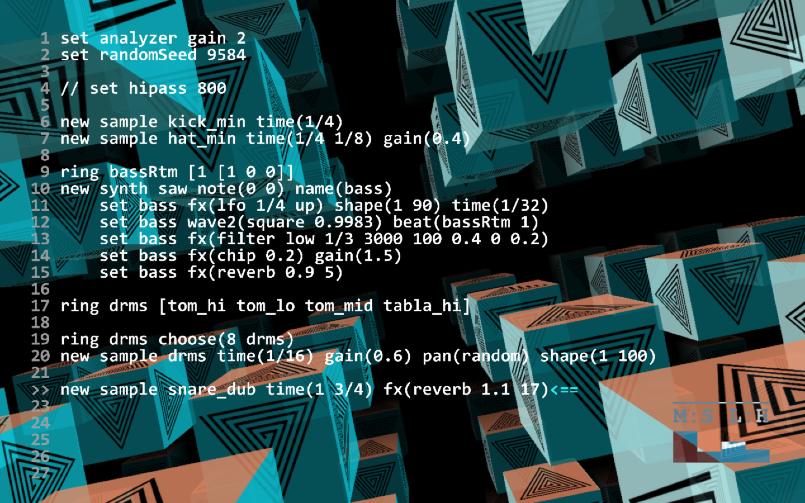

# 🌑 Mercury Live Coding Environment 

## [Become a Patron!](https://www.patreon.com/bePatron?u=9649817) 

**📦 Latest stable release**

[](https://github.com/tmhglnd/mercury/releases)

**📑 Info**

[](https://github.com/tmhglnd/mercury/blob/master/LICENSE)
[](http://github.com/tmhglnd/mercury)
[](https://github.com/tmhglnd/mercury/issues)
[](https://github.com/tmhglnd/mercury/commits/master)

**A minimal and human-readable language for the live coding of algorithmic electronic audiovisual performances.**

Programmed in the Cycling'74 Max8 node-based creative coding environment, as an abstracted layer on the Max/MSP audio engine and with the use of Node4Max for parsing, lexing and generative algorithms and Jitter/OpenGL for the visuals and the responsive texteditor.

>See also the [NodeJS Total-Serialism Package](https://github.com/tmhglnd/total-serialism#total-serialism) for an extensive library of Algorithmic Composition Methods


## 📋 Table of Contents

- [Newest Features](#-newest-features)
- [About](#-about)
- [Vision & Goals](#-vision--goals)
- [Tutorial (work in progress...)](#-tutorial)
- [Install](#-install)
	- [Getting Started](#-getting-started)
	- [System Requirements](#-system-requirements)
	- [Build Application](#-build-application)
	- [Documentation](#-documentation)
	- [Sounds in Mercury](#-sounds)
- [Modify Code](#-modify-code)
- [Further Reading](#-further-reading-and-listening)
- [Made with Mercury](#-made-with-mercury)
- [Powered By](#-powered-by)
- [Thanks](#-thanks)
- [Licenses](#-licenses)

## 🎉 Newest Features

**Input OSC addresses as arguments for instrument methods and control the parameters externally**

```java
set osc default

new synth sine name(sn)
    set sn note(/sine/pitch 0) shape(5 /sine/release)
    set sn fx(reverb 1 /sine/verb)
```

**new `OSC`-object, output sequences as osc-messages, custom naming of messages in a intuitive way (similar to making instruments).**

```java
set osc default

new emitter osc name(myOSC) someParam(3.14)
// result => /myOsc/someParam 3.14
```

## 📟 About 

>Mercury is a minimal and human-readable language for the live coding of algorithmic electronic music. 

All elements of the language are designed around making code more accessible and less obfuscating for the audience. This motivation stretches down to the coding style itself which uses clear descriptive names for functions and a clear syntax. Furthermore the editor is restricted to 30 lines of code, keeping all code always visible. Mercury provides the performer with an extensive library of algorithms to generate or transform numbersequences that can modulate parameters, such as melody and rhythm, over time. The environment produces sound in conjunction with visuals. Besides looking at the code, the audience is also looking at the visuals that are reactive to the sound or generated by the sound.

It is named after te planet Mercury. Mercury rules the creation and expression of our mental processes. The planet implores us to express ourselves. Mercury is about a quick wit, quick thinking. It lets us move from one thing to the next.

Mercury uses the [Total Serialism NodeJS](https://github.com/tmhglnd/total-serialism#total-serialism) package available on npmjs.com. This package features many algorithmic composition methods.



## 🔭 Vision / Goals

- Providing a quick and hands-on coding environment/language for expression, communication and improvisation of livecoded works.
- Using the language as a teaching environment for:
	- introduction in (electronic) music
	- algorithmic composition
	- sequencing
	- synthesis (upcoming)
	- creative coding and live coding.
- Providing creatives with an extensive library of algorithmic composition techniques
	- released as a seperate Node Package titled [Total-Serialism](https://www.npmjs.com/package/total-serialism)
	- exposed in the Mercury environment through Node4Max
- Providing creatives with a multi-purpose non-linear-sequencer 
	- using OSC to communicate with other (creative-coding) platforms
	- using MIDI to communicate with other environments (upcoming)
- Providing creatives with easy sampler/synthesis for sounddesign and composing
	- using external OSC to control parameters in the sampler/synthesis
	- using external MIDI devices and messages to play the sampler/synthesizers (upcoming)
- Working towards a stand-alone application for MacOS and Windows, making workflow easier (upcoming)
- Extending the Mercury users-community and including extensions on the environment in the master-branch

Mercury is a development-in-progress and the language is still very much fluid, with changes made to the language/environment/libraries almost weekly. Feel free the clone/fork this repository, but you might also want to watch and/or star the repo to keep up-to-date with the latest changes whenever they're made.

## 📖 Tutorial

🚧 (work in progress) 🚧

If this is your first time with either the usage of creative coding software (like Max8), music theory, electronic music making and programming in general I highly recommend following the [tutorial](/docs/tutorial.md)

[Open the Tutorial](/docs/tutorial.md)

## 💻 Install

Read the [system requirements](#system-requirements) first before getting started.

1. Download and install **Max 8.0.8** (no License required to run Mercury!)
	- [Windows](https://akiaj5esl75o5wbdcv2a-maxmspjitter.s3.amazonaws.com/Max808_x64_190808.zip)
	- [Mac](https://akiaj5esl75o5wbdcv2a-maxmspjitter.s3.amazonaws.com/Max808_190808.dmg)
	- If links are not working go to [https://cycling74.com/downloads/older](https://cycling74.com/downloads/older)
	- *Newer versions of Max can be used as well, but 8.0.8 has proven to be the most stable so far*
<!--
2. Add the following dependencies to the `~/Documents/Max 8/Packages` folder:
	- [`misc-max-abstractions`](https://github.com/tmhglnd/misc-max-abstractions)
	- [`reverb-yafr-mods`](https://github.com/tmhglnd/reverb-yafr-mods)
	- Optional:
		- `Syphon` : available as download in the Max Package Manager
	<!-- - [~~pass-comparators~~](https://github.com/tmhglnd/pass-comparators) <- now included in the package
	<!-- - ~~jasch package~~ <- temporarily disabled function -->

2. Download, clone or fork Mercury to the Projects folder in your Documents:
```
1. Download zip and unpack in ~/Documents/Max 8/Projects (create Projects folder if necessary)
2. Open mercury_ide.maxproj
```
commandline:
```
$ cd ~/Documents/Max\ 8/Projects
    if not a directory, first: 
    $ mkdir ~/Documents/Max\ 8/Projects
    $ cd ~/Documents/Max\ 8/Projects

$ git clone http://github.com/tmhglnd/mercury
```

### 🚀 Getting Started

[Open the Getting Started Guide](/docs/getting-started.md)

### ⚠ System Requirements

These system requirements are the requirements to install and run Max8 on your computer. A dedicated Graphics Card (GPU) is recommended to run the visual side of Mercury smoothly (the text-editor is part of the visuals since it is programmed in the OpenGL language).

```
Mac OSX 10.11.6 or later
Intel® Core™2 Duo processor (Intel® Core™ i5 or higher recommended) 
4 GB RAM (8 GB or more recommended)
(Dedicated Graphics Card recommended)
```

```
Windows 7, 8 or 10
64-bit Intel® or AMD multi-core processor. (Intel® Core™ i5 or higher processor or recommended)
4 GB RAM (8 GB or more recommended)
(Dedicated Graphics Card recommended)
```

Tested working on a variety of computers and operating systems.

```
Mac OSX 10.12
Mac OSX 10.14
Microsoft Windows 10 Home
```

### 🛠 Build Application

`Optional`

**Why?** - Building the Application is recommended when using Mercury with other MaxMSP projects. This will allow Mercury to have a seperate thread from the other Max processes, giving it enough RAM and CPU space. Also the application will probably run more stable because the project can not be editted anymore. This, of course, also dependents on your systems specifications.

**How?** - The Cycling'74 Coding environment is needed to build the application from the `mercury_ide_x.x.x.maxproj` file. Open the `.maxproj` file and select `Build Collective/Application` from the `Settings` menu on the bottom of the project window. *Building the Application is not necessary in order to run the environment!*

### 📖 Documentation

[Open the documentation](/docs/README.md)

### 🎵 Sounds

All sounds in Mercury are downloaded from [freesound.org](http://www.freesound.org) and are licensed with Creative Commons Attribution or Creative Commons 0 licenses. A list of all the available sounds and the original sample can be found here:

[List of sounds and credits](././mercury_ide_0.9.9/media/README.md)

## 📝 Modify Code

`patchers` - Requires Max8 environment and license to edit/modify/save the patchers of this project.

`JS code` - Requires a standard code-editor (eg. VSCode or Atom) to edit/modify/save the JS code.

`GenExpr Code` - Requires a standard code-editor (eg. VSCode or Atom) to edit/modify/save the GenExpr code.

## 🔍 Further reading and listening

1. [Mercury homepage](http://www.timohoogland.com/mercury-livecoding)
2. [Paper in ICLC 2019](http://iclc.livecodenetwork.org/2019/papers/paper67.pdf)
3. [Music on bandcamp](http://timohoogland.bandcamp.com)

## 👾 Made with Mercury

- *Made something with Mercury? Please add a URL here and send a pull request! ^^*
- [Rafa & Timo - "Hello, off-world!" (Live at NMF)](https://www.youtube.com/watch?v=7UWywv_DPHI&t=4s)
- [Roald van Dillewijn - Mercury & DigiLog](https://www.youtube.com/watch?v=1v7xicXuSbo&t=346s)
- [Sasj & Timo - Amalgam (Live at Github Sattelite 2020)](https://www.youtube.com/watch?v=zzmgX4QSBMM)
- [Timo - Live at NerdLab VR 2020](https://www.youtube.com/watch?v=EW9x68sxhvM)
- [T.mo - Live at Eulerroom Equinox 2020](https://www.youtube.com/watch?v=X0FFcdd1QEE)
- [T.mo - Live at Algo:Ritmi 2020](https://www.facebook.com/timohoogland/videos/3654187371320680/)
- [T.mo - Live at NLCL Meetup STEIM](https://www.youtube.com/watch?v=leckC_yUMss)

## 🔋 Powered By

- Mercury has been granted funding from [**Creative Industries Fund NL**](https://stimuleringsfonds.nl/en/)
- Mercury has been granted in-kind funding from [**Creative Coding Utrecht**](https://creativecodingutrecht.nl/)

## 🙏 Thanks

- Anne Veinberg for working with Mercury and a Mercury extensions for the [CodeKlavier](https://codeklavier.space/) project
- Rafaele Maria Andrade for collaboration on [networked performance](https://www.youtube.com/watch?v=7UWywv_DPHI&t=4s) between Mercury and Knurl
- Roald van Dillewijn for working together on osc and midi functionalities combined with his [Digilog modified guitar-pedals](https://roaldvandillewijn.nl/projects/digilog)
- Guillem Gongora Moral for using Mercury as a composition tool and sharing valuable feedback in the process
- Repo banner image by Annebel Bunt
- Live performance image by Zuzanna Zgierska

## 📄 Licenses

1. Main Source - [The GNU GPL v.3 License](https://choosealicense.com/licenses/gpl-3.0/) (c) Timo Hoogland 2019
2. Sound Files - Individually licensed, listed under [media/README.md](/mercury_ide_0.9.9/media/README.md)
3. Documentation - [The CC BY-SA 4.0 License](https://creativecommons.org/licenses/by-sa/4.0/) (c) Timo Hoogland 2019
4. Examples - [The CC BY-SA 4.0 License](https://creativecommons.org/licenses/by-sa/4.0/) (c) Timo Hoogland 2019
5. Max8 - Proprietary Software, Max (c) 1990-2019 Cycling'74 / IRCAM All rights reserved

THE SOFTWARE IS PROVIDED "AS IS", WITHOUT WARRANTY OF ANY KIND, EXPRESS OR IMPLIED, INCLUDING BUT NOT LIMITED TO THE WARRANTIES OF MERCHANTABILITY, FITNESS FOR A PARTICULAR PURPOSE AND NONINFRINGEMENT. IN NO EVENT SHALL THE AUTHORS OR COPYRIGHT HOLDERS BE LIABLE FOR ANY CLAIM, DAMAGES OR OTHER LIABILITY, WHETHER IN AN ACTION OF CONTRACT, TORT OR OTHERWISE, ARISING FROM, OUT OF OR IN CONNECTION WITH THE SOFTWARE OR THE USE OR OTHER DEALINGS IN THE SOFTWARE.
